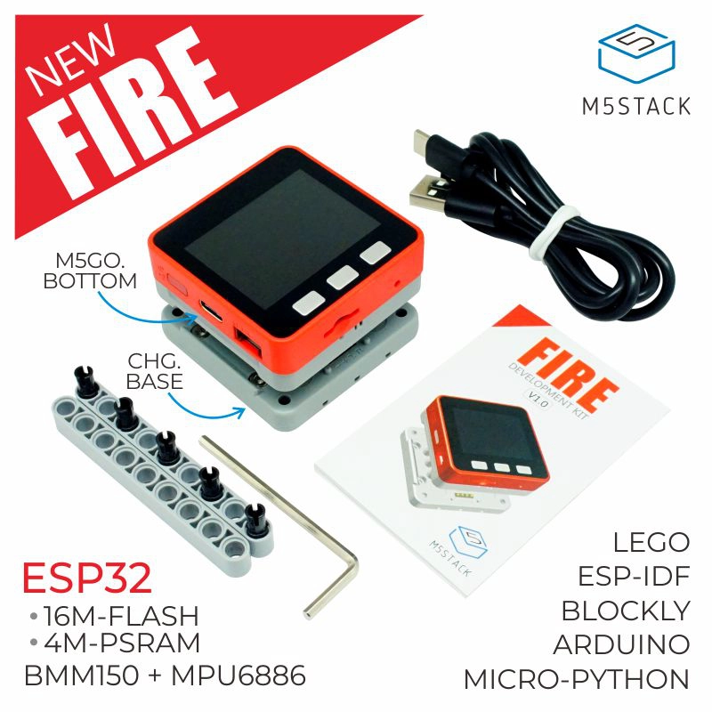

# claude-desktop-buddy — M5Stack Core Fire port

This is a port of [claude-desktop-buddy](https://github.com/anthropics/claude-desktop-buddy)
by **[Felix Rieseberg](https://github.com/felixrieseberg)** to the
**M5Stack Core Fire**. All credit for the original concept, firmware
architecture, ASCII pets, GIF character system, and BLE protocol goes to
Felix. This fork adds a second PlatformIO build target (`m5stack-fire`)
while keeping the original M5StickC Plus target (`m5stickc-plus`) intact.

---

Claude for macOS and Windows can connect Claude Code and Claude Desktop to
maker devices over BLE, so developers and makers can build hardware that
displays permission prompts, recent messages, and other interactions.

> **Building your own device?** You don't need any of the code here. See
> **[REFERENCE.md](REFERENCE.md)** for the wire protocol: Nordic UART
> Service UUIDs, JSON schemas, and the folder push transport.

The firmware implements a desk pet on ESP32 that lives off permission
approvals and interaction with Claude. It sleeps when nothing's happening,
wakes when sessions start, gets visibly impatient when an approval prompt is
waiting, and lets you approve or deny right from the device.

<p align="center">
  
</p>

## Hardware

The firmware targets the **M5Stack Core Fire** (ESP32, 320×240 ILI9342 display,
MPU6886 IMU, IP5306 power, 10× WS2812B NeoPixel bar). Build with the
`m5stack-fire` PlatformIO environment. The original M5StickC Plus target
(`m5stickc-plus`) is still supported in the same source tree.

## Flashing

Install
[PlatformIO Core](https://docs.platformio.org/en/latest/core/installation/),
then:

```bash
pio run -e m5stack-fire -t upload
```

If you're starting from a previously-flashed device, wipe it first:

```bash
pio run -e m5stack-fire -t erase && pio run -e m5stack-fire -t upload
```

Once running, you can also wipe everything from the device itself: **hold A
→ settings → reset → factory reset → tap twice**.

## Pairing

To pair your device with Claude, first enable developer mode (**Help →
Troubleshooting → Enable Developer Mode**). Then, open the Hardware Buddy
window in **Developer → Open Hardware Buddy…**, click **Connect**, and pick
your device from the list. macOS will prompt for Bluetooth permission on
first connect; grant it.

<p align="center">
  
  
</p>

Once paired, the bridge auto-reconnects whenever both sides are awake.

If discovery isn't finding the stick:

- Make sure it's awake (any button press)
- Check the stick's settings menu → bluetooth is on

## Controls

|                       | Normal               | Pet         | Info        | Approval    |
| --------------------- | -------------------- | ----------- | ----------- | ----------- |
| **A** (left)          | next screen          | next screen | next screen | **approve** |
| **B** (middle)        | scroll transcript    | next page   | next page   | **deny**    |
| **C** (right)         | toggle screen off    |             |             |             |
| **Hold A**            | menu                 | menu        | menu        | menu        |
| **Shake**             | dizzy                |             |             | —           |
| **Face-down**         | nap (energy refills) |             |             |             |

The screen auto-powers-off after 30s of no interaction (kept on while an
approval prompt is up). Any button press wakes it.

## Menu

Hold **A** from any screen to open the main menu. Press **A** to move the
cursor, **B** to confirm the selected item.

| Item         | Action                                                                 |
| ------------ | ---------------------------------------------------------------------- |
| **settings** | Open the settings submenu (brightness, sound, BLE, etc.)              |
| **rotate**   | Rotate the display 90° clockwise. Press B repeatedly to keep rotating. The current angle (0 / 90 / 180 / 270) is shown next to the label. Choice persists across reboots. |
| **turn off** | Power off (deep sleep on Core Fire, AXP power-off on StickC Plus)     |
| **help**     | Open the button-reference info page                                    |
| **about**    | Open the credits info page                                             |
| **demo**     | Toggle demo mode (cycles fake Claude sessions every 8s)               |
| **close**    | Close the menu                                                         |

## Screen rotation

The display can be rotated in 90° increments to suit how the device is
mounted. Open the menu (**hold A**), navigate to **rotate**, and press **B**
once per 90° step. The menu stays open so you can keep pressing B until the
orientation is right, then navigate away or hold A to close.

The setting survives reboots — no need to re-rotate after a power cycle.
ASCII pets and GIF characters both scale and center correctly in every
orientation.

## ASCII pets

Nineteen pets, each with seven animations (sleep, idle, busy, attention,
celebrate, dizzy, heart): capybara, duck, goose, blob, cat, dragon, octopus,
owl, penguin, turtle, snail, ghost, axolotl, cactus, robot, rabbit, mushroom,
chonk, and **sloth** (legendarily slow tick rate — blink and you'll miss it).
Menu → "next pet" cycles them with a counter. Choice persists to NVS.

## GIF pets

If you want a custom GIF character instead of an ASCII buddy, drag a
character pack folder onto the drop target in the Hardware Buddy window. The
app streams it over BLE and the stick switches to GIF mode live. **Settings
→ delete char** reverts to ASCII mode.

A character pack is a folder with `manifest.json` and 96px-wide GIFs:

```json
{
  "name": "bufo",
  "colors": {
    "body": "#6B8E23",
    "bg": "#000000",
    "text": "#FFFFFF",
    "textDim": "#808080",
    "ink": "#000000"
  },
  "states": {
    "sleep": "sleep.gif",
    "idle": ["idle_0.gif", "idle_1.gif", "idle_2.gif"],
    "busy": "busy.gif",
    "attention": "attention.gif",
    "celebrate": "celebrate.gif",
    "dizzy": "dizzy.gif",
    "heart": "heart.gif"
  }
}
```

State values can be a single filename or an array. Arrays rotate: each
loop-end advances to the next GIF, useful for an idle activity carousel so
the home screen doesn't loop one clip forever.

GIFs are 96px wide; height up to ~140px fits within the character area on screen.
Crop tight to the character — transparent margins waste screen and shrink
the sprite. `tools/prep_character.py` handles the resize: feed it source
GIFs at any sizes and it produces a 96px-wide set where the character is the
same scale in every state.

The whole folder must fit under 1.8MB —
`gifsicle --lossy=80 -O3 --colors 64` typically cuts 40–60%.

See `characters/bufo/` for a working example.

If you're iterating on a character and would rather skip the BLE round-trip,
`tools/flash_character.py characters/bufo` stages it into `data/` and runs
`pio run -t uploadfs` directly over USB.

## The seven states

| State       | Trigger                     | Feel                        |
| ----------- | --------------------------- | --------------------------- |
| `sleep`     | bridge not connected        | eyes closed, slow breathing |
| `idle`      | connected, nothing urgent   | blinking, looking around    |
| `busy`      | sessions actively running   | sweating, working           |
| `attention` | approval pending            | alert, **LED blinks**       |
| `celebrate` | level up (every 50K tokens) | confetti, bouncing          |
| `dizzy`     | you shook the stick         | spiral eyes, wobbling       |
| `heart`     | approved in under 5s        | floating hearts             |

## Project layout

```
src/
  main.cpp       — loop, state machine, UI screens
  buddy.cpp      — ASCII species dispatch + render helpers
  buddies/       — one file per species, seven anim functions each
  ble_bridge.cpp — Nordic UART service, line-buffered TX/RX
  character.cpp  — GIF decode + render
  data.h         — wire protocol, JSON parse
  xfer.h         — folder push receiver
  stats.h        — NVS-backed stats, settings, owner, species choice
characters/      — example GIF character packs
tools/           — generators and converters
```

## Availability

The BLE API is only available when the desktop apps are in developer mode
(**Help → Troubleshooting → Enable Developer Mode**). It's intended for
makers and developers and isn't an officially supported product feature.
